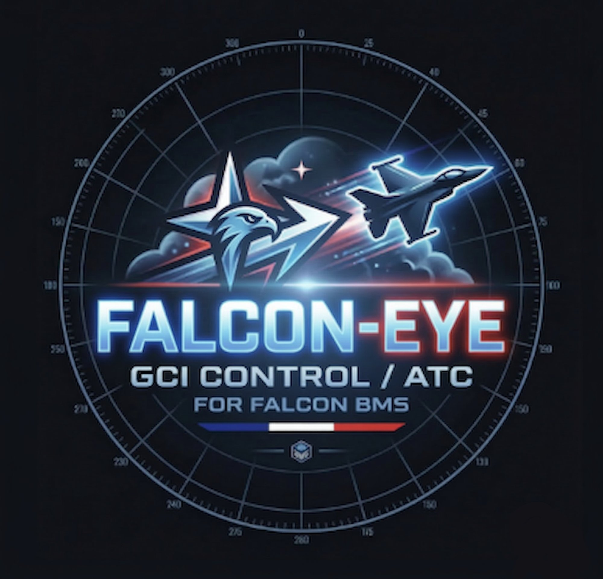
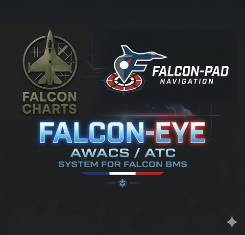

  

<h1 align="center">Falcon-Eye</h1>

<em>AWACS / ATC System for Falcon BMS</em>

  
  
  
  

---

## 🇫🇷 Français

### C'est quoi ?

Falcon-Eye est un scope radar **gratuit et open source** dédié aux **contrôleurs AWACS/GCI et ATC** sur Falcon BMS. Il se connecte en temps réel à votre session BMS et affiche tous les contacts aériens sur une carte tactique — avec BRAA, bullseye, anneaux SAM et radio IVC intégrés.

📧 contact@falcon-charts.com

### Téléchargement

👉 **[Télécharger FalconEye.exe](../../releases/latest)**

> ⚠️ **Windows SmartScreen** peut bloquer le premier lancement car l'exe n'est pas signé.  
> Cliquer **"Informations complémentaires" → "Exécuter quand même"**.

### Démarrage rapide

1. Lancer **Falcon BMS** et démarrer une mission
2. Lancer **FalconEye.exe**
3. Laisser `127.0.0.1` si BMS tourne sur la même machine, sinon entrer l'IP du serveur
4. Cliquer **Connecter**
5. Les contacts apparaissent immédiatement

**Optionnel — Carte mission :** Bouton **MISSION** → charger votre fichier `.ini` BMS pour les anneaux SAM, la route, le bullseye et les lignes de front.

**Optionnel — Radio IVC :** Lancer **IVC Client.exe** depuis le launcher BMS. Falcon-Eye lit automatiquement les fréquences depuis BMS.

### Fonctionnalités

| | |
|---|---|
| 🎯 **Radar temps réel** | Contacts live depuis BMS via Tacview TRTT |
| 📡 **Portée réaliste** | Filtre ligne de mire basé sur l'altitude |
| 🔴 **BRAA** | Ctrl+clic allié → clic cible → bearing/range/alt/aspect live |
| 🗺️ **Overlay mission** | Bullseye, route, anneaux SAM, lignes FLOT |
| 📻 **Radio IVC** | Fréquences UHF/VHF depuis BMS, presets en un clic |
| ✈️ **Flight strips** | Callsign, vitesse, cap, altitude, ID code |
| 🗺️ **Carte locale** | Côtes, DMZ, aéroports, pistes — aucun internet requis |

### Raccourcis

| Action | Commande |
|---|---|
| Zoom | Molette souris |
| Ouvrir flight strip | Clic gauche sur contact |
| Définir source BRAA | Ctrl+clic sur allié |
| Compléter BRAA | Clic gauche sur cible |
| Règle de mesure | Clic droit |
| Annuler BRAA | Échap |

---

## 🇬🇧 English

### What is it?

Falcon-Eye is a **free and open source** radar scope for **AWACS/GCI and ATC controllers** in Falcon BMS. It connects in real-time to your BMS session and displays all air contacts on a tactical map — with BRAA, bullseye, SAM rings, and integrated IVC radio.

📧 contact@falcon-charts.com

### Download

👉 **[Download FalconEye.exe](../../releases/latest)**

> ⚠️ **Windows SmartScreen** may block the first launch since the exe is unsigned.  
> Click **"More info" → "Run anyway"**.

### Quick start

1. Launch **Falcon BMS** and start a mission
2. Launch **FalconEye.exe**
3. Leave `127.0.0.1` if BMS is on the same machine, otherwise enter the server IP
4. Click **Connecter** — contacts appear immediately

### Features

| | |
|---|---|
| 🎯 **Live radar** | Real-time contacts via Tacview TRTT |
| 📡 **Realistic range** | Line-of-sight altitude filter |
| 🔴 **BRAA** | Ctrl+click ally → click target → bearing/range/alt/aspect live |
| 🗺️ **Mission overlay** | Bullseye, route, SAM rings, FLOT lines |
| 📻 **IVC Radio** | UHF/VHF from BMS SharedMemory |
| ✈️ **Flight strips** | Callsign, speed, heading, altitude, ID code |
| 🗺️ **Local map** | Coastlines, DMZ, airports, runways — no internet required |

### Controls

| Action | Input |
|---|---|
| Zoom | Mouse wheel |
| Open flight strip | Left-click contact |
| Set BRAA source | Ctrl+click ally |
| Complete BRAA | Left-click target |
| Ruler | Right-click |
| Cancel BRAA | Escape |

---

## Crédits / Credits

  

**Développé par / Developed by [Riesu](https://falcon-charts.com)**

| | |
|---|---|
| 🌐 Falcon-Eye | [eye.falcon-charts.com](https://eye.falcon-charts.com) |
| 🌐 Falcon Charts | [falcon-charts.com](https://falcon-charts.com) |
| 🌐 Falcon-Pad | [pad.falcon-charts.com](https://pad.falcon-charts.com) |

| 🌐 Falcon BMS | [falcon-bms.com](https://www.falcon-bms.com) |

| 🌐 FFW01 | [ffw-01.fr](https://www.ffw-01.fr) |
| 🌐 FFW36 | [ffw36.com](http://www.ffw36.com) |

**Remerciements / Thanks:**
- **BMS Team** — pour ce superbe simulateur / for this outstanding simulator (https://www.falcon-bms.com)
- **FFW01** — Escadrille virtuelle (https://www.ffw-01.fr)
- **FFW36** — Escadrille virtuelle (http://www.ffw36.com)

**Buy Falcon 4** - (https://store.steampowered.com/app/429530/Falcon_40)

> Falcon-Eye est un outil communautaire indépendant. Il n'existe aucun lien officiel entre Falcon-Eye et les créateurs de Falcon 4 ou de Falcon BMS. 
> Falcon-Eye is an independent community tool. There is no official connection between Falcon-Eye and the creators of Falcon 4 or Falcon BMS.

---

## Licence / License

GNU General Public License v3.0 — [LICENSE](LICENSE)

