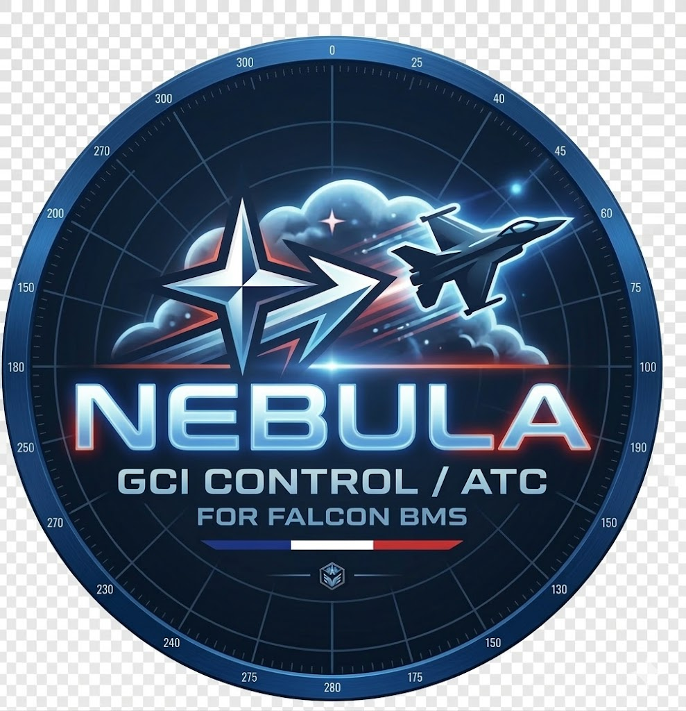

# Nebula GCI

<p align="center">
  
</p>

<p align="center">
  <strong>Ground Control Intercept tool for Falcon BMS</strong><br>
  <em>By Riesu — <a href="mailto:contact@falcon-charts.com">contact@falcon-charts.com</a></em><br>
  <a href="https://falcon-charts.com">falcon-charts.com</a>
</p>

<p align="center">
  
  
  
  
</p>

---

## 🇬🇧 English

### What is this?

If you've ever played GCI in Falcon BMS, you know the pain. You're stuck on the 2D map, alt-tabbing between the game and a notepad, trying to give BRAA calls while squinting at tiny dots. Nebula fixes that.

Nebula GCI is a standalone radar scope that connects to BMS via Tacview Real-Time Telemetry (TRTT). It gives you a god-view of every aircraft on the theatre — friendlies, hostiles, missiles, the lot — on a proper tactical map with military symbology.

No more guessing. No more "standby, looking". Click an ally, click a bogey, read the BRAA. Done.

### What it does

- **Live tactical map** — Every air contact on the theatre in real time. Green squares for friendlies, red diamonds for hostiles, just like a real radar scope.
- **BRAA tool** — Right-click an ally, left-click a bogey. Bearing, range, altitude, aspect — updated every half second. You can stack multiple BRAAs at once, each one draws a dashed line on the map.
- **Mission loading** — Drop in your BMS .ini file. Bullseye, route, SAM rings, FLOT lines, reference points — everything appears on the map.
- **Flight strip** — Click any contact to see callsign, speed, heading, altitude, group/package in a floating strip that updates live.
- **Radio panel** — BMS frequency presets, ready for when you need to coordinate.
- **Camp detection** — BMS doesn't always tell you who's who. Nebula figures it out from the aircraft type, the same way F4Radar and OpenRadar do. F-16? Blue. MiG-29? Red. Simple.
- **Everything is configurable** — Icon sizes, colors, label sizes, trails, vectors. Make it look exactly how you want.

### Getting started

You need Python 3.10+ and two packages:

```bash
pip install PyQt6 PyQt6-WebEngine
```

Then just run it:

```bash
python main.py
```

1. Make sure BMS is running with TRTT enabled (Tacview Real-Time Telemetry, port 42674)
2. Click **CONNECTER** — the default settings point to localhost, which is what you want if BMS runs on the same machine
3. Load a mission file with **MISSION** if you want SAM rings and bullseye
4. That's it. Contacts will start appearing as soon as the campaign is running.

### How it works under the hood

Nebula reads the ACMI data stream from BMS via TCP (same protocol Tacview uses). It parses every contact's position, speed, heading, type, coalition, and callsign, then pushes everything to a Leaflet map running inside a Qt WebEngine view. The map uses military symbology — squares, diamonds, circles — with configurable colors and sizes.

Camp detection works in three layers: first it checks the Color field from TRTT, then Coalition, and if neither is available (which happens a lot), it falls back to identifying the aircraft type against a built-in database of blue and red aircraft.

### Building an executable

```bash
pip install pyinstaller
pyinstaller --onedir --windowed --name "Nebula_GCI" --icon=assets/nebula.ico main.py
```

The executable will be in `dist/Nebula_GCI/`.

---

## 🇫🇷 Français

### C'est quoi ?

Si tu as déjà fait du GCI sur Falcon BMS, tu connais la galère. Tu es bloqué sur la carte 2D, tu alt-tab entre le jeu et un bloc-notes, tu essaies de donner des BRAA en plissant les yeux sur des points minuscules. Nebula règle ça.

Nebula GCI est un scope radar standalone qui se connecte à BMS via le Tacview Real-Time Telemetry (TRTT). Il te donne une vue complète de tous les avions du théâtre — alliés, hostiles, missiles — sur une vraie carte tactique avec la symbologie militaire.

Plus besoin de deviner. Plus de "standby, je cherche". Tu cliques sur un allié, tu cliques sur un bogey, tu lis le BRAA. C'est fait.

### Ce que ça fait

- **Carte tactique en temps réel** — Tous les contacts aériens du théâtre. Carrés verts pour les alliés, losanges rouges pour les hostiles, comme un vrai scope radar.
- **Outil BRAA** — Clic-droit sur un allié, clic gauche sur un bogey. Bearing, range, altitude, aspect — mis à jour toutes les demi-secondes. Tu peux empiler plusieurs BRAA en même temps, chacun trace une ligne pointillée sur la carte.
- **Chargement de mission** — Glisse ton fichier .ini BMS. Bullseye, route, anneaux SAM, lignes FLOT, points de référence — tout apparaît sur la carte.
- **Flight strip** — Clique sur n'importe quel contact pour voir le callsign, la vitesse, le cap, l'altitude, le groupe/package dans une strip flottante qui se met à jour en direct.
- **Panneau radio** — Les presets de fréquence BMS, prêts pour la coordination.
- **Détection de camp** — BMS ne dit pas toujours qui est qui dans le TRTT. Nebula le déduit du type d'avion, comme le font F4Radar et OpenRadar. F-16 ? Bleu. MiG-29 ? Rouge. Simple.
- **Tout est configurable** — Taille des icônes, couleurs, taille des labels, trails, vecteurs. Fais-le ressembler exactement à ce que tu veux.

### Pour commencer

Il te faut Python 3.10+ et deux packages :

```bash
pip install PyQt6 PyQt6-WebEngine
```

Ensuite lance :

```bash
python main.py
```

1. Vérifie que BMS tourne avec le TRTT activé (Tacview Real-Time Telemetry, port 42674)
2. Clique **CONNECTER** — les paramètres par défaut pointent vers localhost, c'est ce qu'il faut si BMS tourne sur la même machine
3. Charge un fichier mission avec **MISSION** si tu veux les anneaux SAM et le bullseye
4. C'est tout. Les contacts apparaissent dès que la campagne tourne.

### Comment ça marche

Nebula lit le flux ACMI de BMS en TCP (même protocole que Tacview). Il parse la position, vitesse, cap, type, coalition et callsign de chaque contact, puis envoie tout à une carte Leaflet dans une vue Qt WebEngine. La carte utilise la symbologie militaire — carrés, losanges, cercles — avec des couleurs et tailles configurables.

La détection de camp fonctionne en trois couches : d'abord le champ Color du TRTT, puis Coalition, et si aucun n'est disponible (ce qui arrive souvent), il identifie le type d'avion dans une base de données intégrée d'appareils bleus et rouges.

### Créer un exécutable

```bash
pip install pyinstaller
pyinstaller --onedir --windowed --name "Nebula_GCI" --icon=assets/nebula.ico main.py
```

L'exécutable sera dans `dist/Nebula_GCI/`.

---

## Architecture

```
Falcon BMS (TRTT port 42674)
       │
       ▼
TRTTClient ─── ACMI stream parser ─── Track objects
       │
       ▼
RadarWidget (PyQt6 + Leaflet.js)
       │
       ├── Military symbology (■ □ ◆ ◇ ● ○ ▲)
       ├── BRAA calculator (ally → bogey)
       ├── Mission overlay (SAM, FLOT, route, bullseye)
       ├── Flight strips (live contact info)
       └── Radio panel (BMS frequency presets)
```

## License

GNU General Public License v3.0 — see [LICENSE](LICENSE)

You're free to use, modify, and redistribute this software. If you distribute modified versions, you must also share your source code under the same license.

---

<p align="center">
  <em>Made with ☕ and too many alt-tabs by Riesu</em><br>
  <a href="https://falcon-charts.com">falcon-charts.com</a>
</p>
