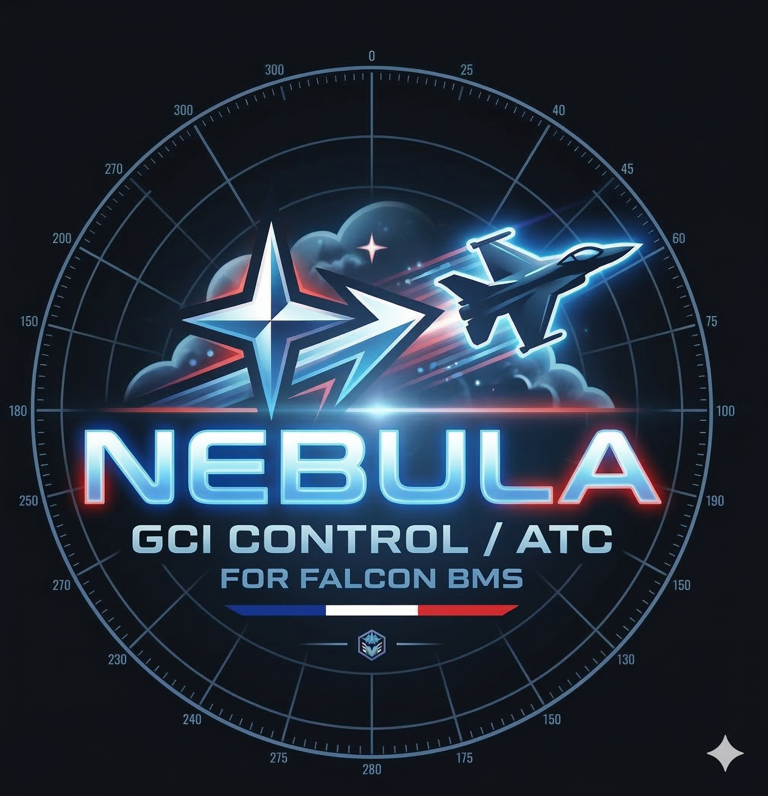

# Nebula GCI

<p align="center">
  
</p>

<p align="center">
  <strong>Ground Control Intercept tool for Falcon BMS</strong><br>
  <em>By Riesu — <a href="mailto:contact@falcon-charts.com">contact@falcon-charts.com</a></em><br>
  <a href="https://falcon-charts.com">falcon-charts.com</a>
</p>

<p align="center">
  
  
  
</p>

---

## 🇬🇧 English

### What is this?

If you've ever played GCI in Falcon BMS, you know the struggle. Alt-tabbing between the 2D map and a notepad, trying to call out BRAAs while squinting at tiny dots on screen. Nebula was built to fix that.

Nebula GCI is a standalone radar scope that connects directly to Falcon BMS. It gives you a god-view of every aircraft on the theatre — friendlies, hostiles, missiles — displayed on a tactical map with proper military symbology. Think of it as your dedicated GCI workstation.

No more guessing who's where. Click an ally, click a bogey, read the BRAA. Done.

### Features

- **Live tactical map** — All air contacts in real time. Green squares for friendlies, red diamonds for hostiles.
- **BRAA tool** — Right-click an ally, left-click a bogey. Bearing, range, altitude, aspect. Updated live, with a dashed line drawn between the two on the map. Stack as many BRAAs as you need.
- **Mission overlay** — Load your BMS .ini file. Bullseye, route, SAM threat rings, FLOT lines, IPs and nav points all appear on the map.
- **Flight strips** — Click any contact for a floating strip with callsign, speed, heading, altitude, and package info.
- **Radio panel** — Standard BMS frequency presets at your fingertips.
- **Fully configurable** — Icon sizes, colors, labels, trails, vectors. Tweak everything from the options panel.

### Quick start

1. Download and extract the archive
2. Run **Nebula_GCI.exe**
3. Start Falcon BMS and launch a campaign or TE
4. In Nebula, click **CONNECTER** — default settings (localhost:42674) work if BMS is on the same machine
5. Optionally, click **MISSION** to load a .ini file for SAM rings and bullseye
6. Contacts appear as soon as the mission is running

### Requirements

- **Falcon BMS 4.37 or 4.38** with TRTT enabled (Tacview Real-Time Telemetry — this is on by default on port 42674)
- That's it. Everything else is bundled in the executable.

### How it connects

Nebula reads the Tacview Real-Time Telemetry stream that BMS broadcasts on port 42674. This is the same data stream that Tacview itself uses for real-time replay. No mods, no plugins, no DLL injection — it just listens to what BMS already sends.

If you're running BMS on a different machine, just enter that machine's IP in the connection dialog instead of 127.0.0.1.

### GCI workflow

A typical GCI session looks like this:

1. Load the mission .ini → SAM rings and bullseye appear
2. Contacts populate as the war kicks off
3. A flight checks in on freq → you see their green squares on the map
4. Bogeys show up as red diamonds heading south
5. Right-click the flight lead → left-click the bogey → BRAA window shows **"Cajun61 → MiG-29G — 270° / 35 NM / FL250 / HOT"**
6. You call it: *"Cajun 6-1, BRAA 270, 35, angels 25, hot"*
7. The BRAA updates live as both aircraft maneuver

---

## 🇫🇷 Français

### C'est quoi ?

Si tu as déjà fait du GCI sur Falcon BMS, tu connais la galère. Alt-tab entre la carte 2D et un bloc-notes, BRAA approximatifs donnés au pif en regardant des points minuscules. Nebula a été créé pour régler ça.

Nebula GCI est un scope radar standalone qui se connecte directement à Falcon BMS. Il affiche tous les avions du théâtre — alliés, hostiles, missiles — sur une carte tactique avec la symbologie militaire. C'est ton poste de travail GCI dédié.

Plus besoin de deviner. Tu cliques sur un allié, tu cliques sur un bogey, tu lis le BRAA. C'est fait.

### Fonctionnalités

- **Carte tactique en temps réel** — Tous les contacts aériens en direct. Carrés verts pour les alliés, losanges rouges pour les hostiles.
- **Outil BRAA** — Clic-droit sur un allié, clic gauche sur un bogey. Bearing, range, altitude, aspect. Mis à jour en live, avec une ligne pointillée entre les deux sur la carte. Empile autant de BRAA que nécessaire.
- **Overlay mission** — Charge ton fichier .ini BMS. Bullseye, route, anneaux de menace SAM, lignes FLOT, IP et points de nav — tout s'affiche.
- **Flight strips** — Clique sur un contact pour une strip flottante avec callsign, vitesse, cap, altitude et infos package.
- **Panneau radio** — Les presets de fréquence BMS standard à portée de clic.
- **Entièrement configurable** — Taille des icônes, couleurs, labels, trails, vecteurs. Règle tout depuis le panneau options.

### Démarrage rapide

1. Télécharge et extrais l'archive
2. Lance **Nebula_GCI.exe**
3. Démarre Falcon BMS et lance une campagne ou un TE
4. Dans Nebula, clique **CONNECTER** — les paramètres par défaut (localhost:42674) fonctionnent si BMS tourne sur la même machine
5. Optionnellement, clique **MISSION** pour charger un fichier .ini (anneaux SAM, bullseye)
6. Les contacts apparaissent dès que la mission tourne

### Prérequis

- **Falcon BMS 4.37 ou 4.38** avec le TRTT activé (Tacview Real-Time Telemetry — activé par défaut sur le port 42674)
- C'est tout. Tout le reste est inclus dans l'exécutable.

### Comment ça se connecte

Nebula lit le flux Tacview Real-Time Telemetry que BMS diffuse sur le port 42674. C'est le même flux que Tacview utilise pour le replay en temps réel. Pas de mod, pas de plugin, pas d'injection de DLL — il écoute simplement ce que BMS envoie déjà.

Si BMS tourne sur une autre machine, entre l'IP de cette machine dans le dialogue de connexion au lieu de 127.0.0.1.

### Le workflow GCI

Une session GCI typique :

1. Tu charges le .ini de la mission → les anneaux SAM et le bullseye apparaissent
2. Les contacts se remplissent quand la guerre démarre
3. Un flight check-in sur la fréquence → tu vois leurs carrés verts sur la carte
4. Des bogeys apparaissent en losanges rouges qui descendent vers le sud
5. Clic-droit sur le flight lead → clic gauche sur le bogey → la fenêtre BRAA affiche **"Cajun61 → MiG-29G — 270° / 35 NM / FL250 / HOT"**
6. Tu annonces : *"Cajun 6-1, BRAA 270, 35, angels 25, hot"*
7. Le BRAA se met à jour en live pendant que les deux avions manœuvrent

---

## Architecture

```
Falcon BMS (TRTT port 42674)
       │
       ▼
TRTTClient ─── ACMI stream parser ─── Track objects
       │
       ▼
RadarWidget (PyQt6 + Leaflet.js)
       │
       ├── Military symbology (■ □ ◆ ◇ ● ○ ▲)
       ├── BRAA calculator (ally → bogey, live update)
       ├── Mission overlay (SAM, FLOT, route, bullseye)
       ├── Flight strips (callsign, speed, heading, altitude)
       └── Radio panel (BMS frequency presets)
```

## License

GNU General Public License v3.0 — see [LICENSE](LICENSE)

You're free to use, modify, and redistribute this software. If you distribute modified versions, you must also share your source code under the same license.

---

<p align="center">
  <em>Made with ☕ and way too many alt-tabs by Riesu</em><br>
  <a href="https://falcon-charts.com">falcon-charts.com</a>
</p>
